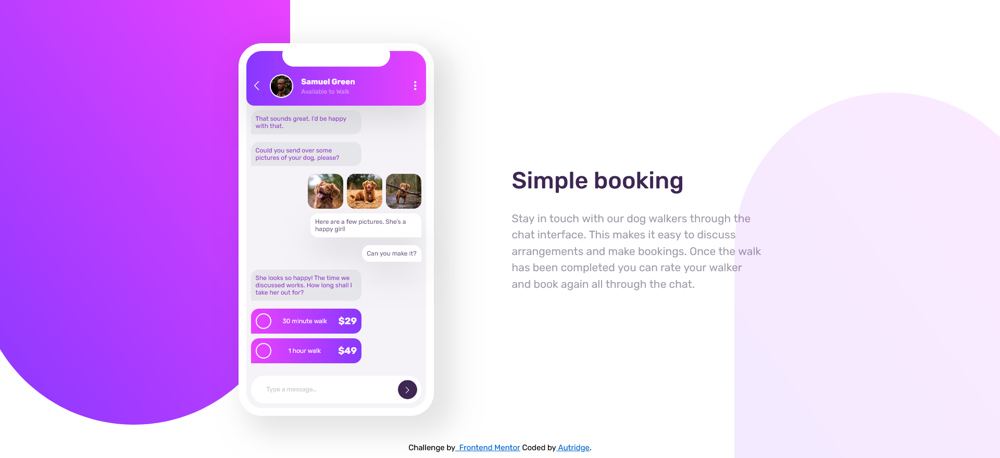

# Frontend Mentor - Chat app CSS illustration solution

This is a solution to the [Chat app CSS illustration challenge on Frontend Mentor](https://www.frontendmentor.io/challenges/chat-app-css-illustration-O5auMkFqY). Frontend Mentor challenges help you improve your coding skills by building realistic projects.

## Table of contents

- [Overview](#overview)
  - [The challenge](#the-challenge)
  - [Screenshot](#screenshot)
  - [Links](#links)
- [My process](#my-process)
  - [Built with](#built-with)
  - [What I learned](#what-i-learned)
  - [Continued development](#continued-development)
  - [Useful resources](#useful-resources)
- [Author](#author)
- [Acknowledgments](#acknowledgments)

## Overview

### The challenge

Users should be able to:

- View the optimal layout for the component depending on their device's screen size
- **Bonus**: See the chat interface animate on the initial load

### Screenshot

### Links

- Live Site URL:[https://autridge.github.io/chat-app-css-illustration/](https://autridge.github.io/chat-app-css-illustration/)

## My process

### Built with

- Semantic HTML5 markup
- CSS custom properties
- Flexbox
- Sass

### What I learned

I reinforced my knowledge on flexbox. But the key takeaway was having a good markup.
Having a good markup helps greatly with parents-sibling concept.

### Useful resources

- [Example resource 1](https://box-shadow.dev/) - This helped me visual to general my containers shadows.

## Author

- Website - [Autridge](https://bento.me/autridge-b-morris)
- Frontend Mentor - [@autridge2](https://www.frontendmentor.io/profile/Autridge)
- Twitter - [@autridgemorris2](https://x.com/autridgemorris2)

## Acknowledgments

Thanks, Frontend Mentor.
This is project-based learning has improved my skills greatly.
Also, thank me, lol.
